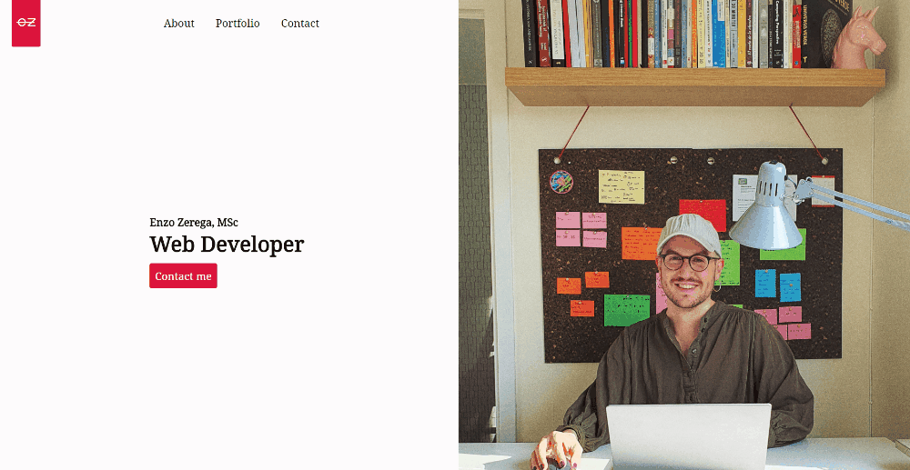

## My personal web page

This app was built using React 16.13.1 .

The app uses:
 - [React router](https://reactrouter.com/) library for route handling
 - [Framer motion](https://www.framer.com/motion/) library for animations between routes.
 - Progressive image loading for landing page picture.
 - [Mailgun](https://www.npmjs.com/package/mailgun) and its npm library for sending emails.
 - [React icons](https://react-icons.github.io/react-icons/) library for downloading icons.
 - [Node-Sass](https://www.npmjs.com/package/node-sass) library for compiling scss files.

## Capture

## Live Site

Check the live version at [enzozerega.com](https://enzozerega.com/).

## Run the app

In the project directory, you can run:

`npm start`

Runs the app in the development mode. Open [http://localhost:3000](http://localhost:3000) to view it in the browser. The page will reload if you make edits. You will also see any lint errors in the console.
